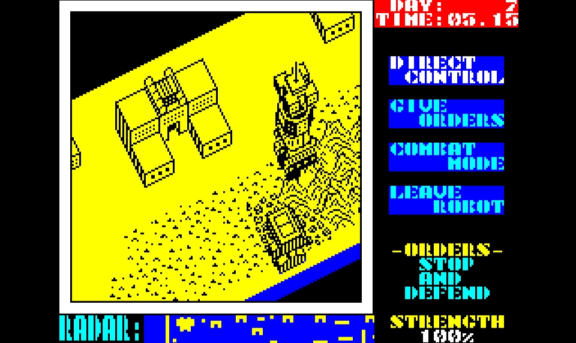
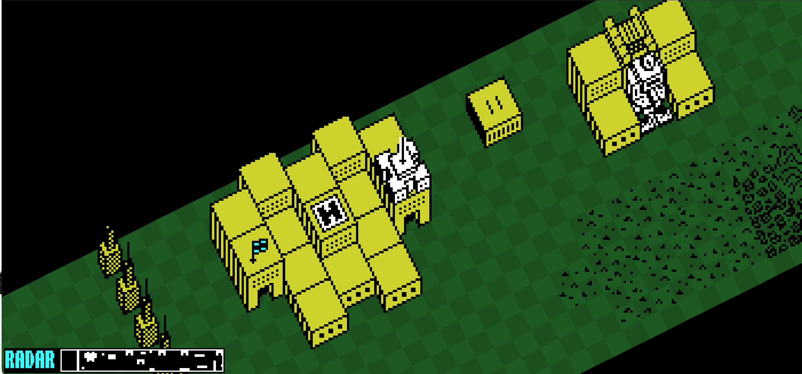

# Nether Earth

Original ZX Spectrum Screenshot:


Browser-based multiplayer clone of the ZX Spectrum version of **Nether Earth**:



The repository is specification-driven. Read `AGENTS.md` and `_specs/` before implementation work.

## Development setup

### Python

Requires Python 3.12+.

```bash
python -m venv .venv
source .venv/bin/activate
python -m pip install --upgrade pip
python -m pip install -e './engine[dev]' -e './backend[dev]'
make python-check
```

Run the backend:

```bash
uvicorn app.main:app --app-dir backend --reload
```

Health check: `http://localhost:8000/health`.

### Frontend

Requires Node.js 24+.

```bash
cd frontend
npm install
npm run protocol:validate
npm run protocol:generate
npm run typecheck
npm run build
npm run dev
```

### Production deployment

Single-VPS Docker Compose stack (gateway Nginx, static frontend, FastAPI backend, host replay
directory). Configure `deploy/.env` from `deploy/.env.example`, then:

```bash
docker compose -f deploy/docker-compose.yml --env-file deploy/.env up -d --build --wait
```

- Operations (TLS, update, rollback, logs, backups): `docs/operations/runbook.md`
- Release procedure and gate: `docs/release/v1-release-checklist.md`
- Hardening evidence: `docs/milestone-10/`

## Quality commands

```bash
make python-check
make frontend-check
make compose-check   # compose config (incl. TLS override) + nginx -t
deploy/smoke.sh      # production images + gateway smoke (Docker, Node 24)
scripts/check-version.sh
```

CI (`.github/workflows/ci.yml`) runs all of these on every PR and push to `main`.
